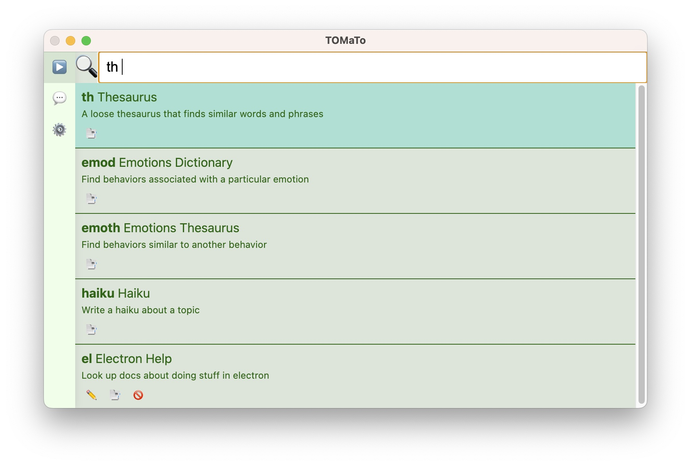
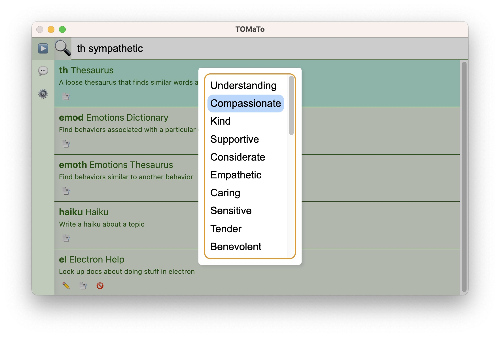
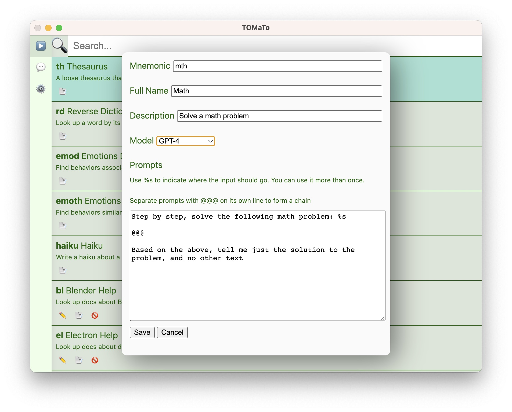
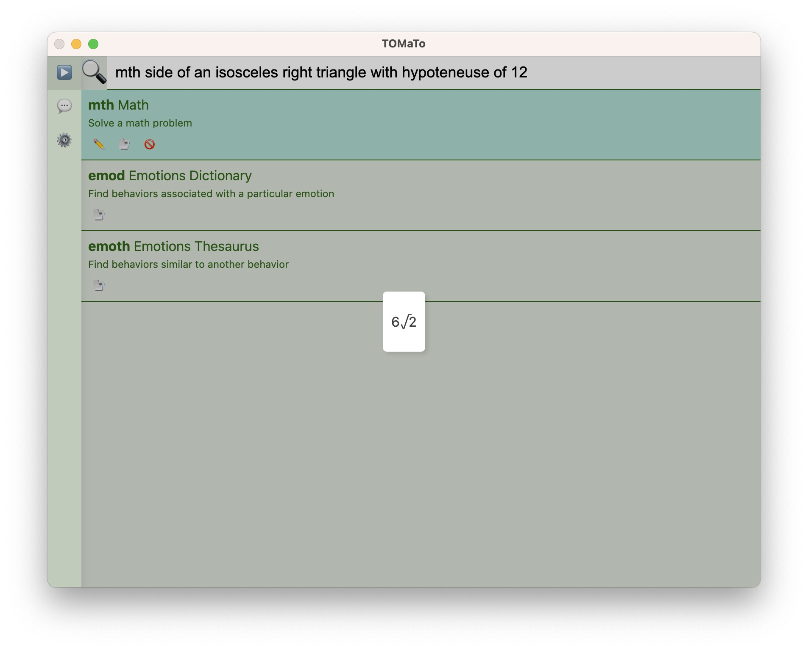

# TOMaTo


TOMaTo is a quick access frontend for ChatGPT which makes it easy to create
simple prompt chains based on user input, known as "chitchats".

TOMaTo excels at finding information that you _know,_ but can't quite remember. I made it for finding stuff that was on the **T**ip **O**f **M**y (**a**hem) **To**ngue.

(Yeah, the name is a stretch.)

These kinds of cases are great, since you don't have to worry so much about the model hallucinating.

## Usage

You invoke TOMaTo either by clicking its icon in the Dock, or by setting up a
hotkey. Then type the "mnemonic" to select a chitchats. For example, typing th
will select the "thesaurus" chitchat:



Type a space, then your input, then hit enter. TOMaTo will have a little talk
with ChatGPT and show you the result:



If your selected chitchat produces a list, it will display in a list view which you can navigate with your arrow keys. Hit enter to copy the selected item to your clipboard.

On any output, you can hit cmd-c to copy the entire output.

Hitting escape will back you out step by step. So from the output, you can hit
escape three times to get back to an empty search.

### Builtin chitchats

The following chitchats are built in:

- **Define**: This is a like a traditional dictionary, but gives an in depth description of the word or phrase you give it, particularly focusing on any specific connotations. You can also give it context. For example `d drill wrt wood` will tell you about the tool and process for making holes, whereas `d drill wrt school` will tell you about practice.

- **Thesaurus**: Look up synonyms for a word. This is more flexible than a traditional thesaurus, as you can type in phrases, or even made-up words in some cases. For example, if you're looking for "unshaven", but all your brain will think of is "scruff-less", TOMaTo can help you out. As with Deep Dictionary, you can add context to get more specific results.

- **Reverse Dictionary**: Can't remember the word for something? Just describe the concept and let the model figure it out for you

- **Emotions Dictionary**: If you're writing a story and find that every character keeps sighing and furrowing their brow, this chitchat will help you mix it up a bit and give your characters some variety in their emotional responses. Just describe the emotion you want to convey and TOMaTo will give you a list of physical responses.

- **Emotion Thesaurus**: Actually, you know what? Why bother typing out an emotion when you could just type "sighing" or "furrowing one's brow". Cut out the middleman and see other responses to the same emotion

- **Haiku**: Truly a useful chitchat. Are you burning to see a haiku about any topic under the sun? TOMaTo has you covered. ChatGPT will pontificate about the concept behind the scenes, then come out with an insightful haiku like:

  > Laughing at app names,

  > Despite the silly title,

  > Great function stands out.

### Custom chitchats

You can create a custom chitchat by duplicating any of the existing ones, and you'll see the chitchat editor:



Here we've set up our model to use GPT-4, and created a chitchat with a two step prompt chain. The first prompt solves the problem, but we don't care about that, so the second step asks only for the answer. We separate the two steps with `@@@`.

Click save, then type in a math problem after our `mth` mnemonic, and:



Side note: This particular chitchat is slow and expensive, since it uses GPT-4. It's also not particularly reliable, even with GPT-4. That's why this isn't a built-in.

## Requirements

- Mac OS 10.13 or later
- An OpenAI Token with ChatGPT access\*

\* Note that using ChatGPT through the API costs a small amount of money, and is not covered by a $20/month ChatGPT Plus subscription. In practice, I have found that it costs a penny or so a day to use the built-in gpt-3.5-turbo prompts. But long prompt chains and prompts with large output may cost significantly more. You can keep an eye on your usage through the OpenAI website.

## Installation

There are no prebuilt releases of of TOMaTo yet, so you'll have to build it yourself. You can built it as follows:

### Install dependencies

```bash
$ npm install
```

### Run a dev build

```bash
$ npm run dev
```

### Build

```bash
# For macOS
$ npm run build:mac
```

The built app will be found at dist/mac-universal/tomato.app

## Development

### Recommended IDE Setup

- [VSCode](https://code.visualstudio.com/) + [ESLint](https://marketplace.visualstudio.com/items?itemName=dbaeumer.vscode-eslint) + [Prettier](https://marketplace.visualstudio.com/items?itemName=esbenp.prettier-vscode)

### Project Setup

### Other platforms

Currently, TOMaTo has only been tested on macOS. It'll probably _kind of_ work
on other OSes, but it will probably need some work on the activation/hiding
front.
